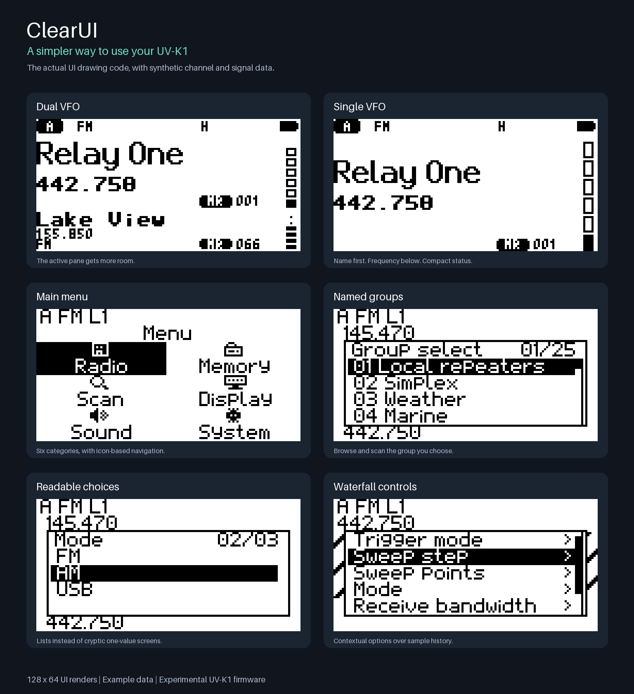

# ClearUI

A community-developed interface for the **Quansheng UV-K1**, based on
[F4HWN Fusion 6.0.0](https://github.com/armel/uv-k1-k5v3-firmware-custom/releases/tag/v6.0.0).
An independent, experimental fork—not an official F4HWN release.

**This branch contains the C10a multiboot and optional scan/watch update.**
It adds Fusion 6 multiboot and separate configuration banks while retaining the
ClearUI interface and HF listening mode. Read [MULTIBOOT.md](MULTIBOOT.md) for
installation, the required C10 CHIRP module, and legacy-memory migration.
See [C10a release notes](RELEASE-C10a.md) for scanning controls and tradeoffs.

> [!WARNING]
> **Use at your own risk.** This firmware can brick your radio, erase calibration
> or cause unexpected transmissions. No warranty, repair or compensation is
> promised. To the fullest extent permitted by law, maintainers and contributors
> disclaim liability for resulting damage, losses, interference or unlawful use.
> **You are responsible for required licenses, authorizations and lawful operation.**
> Read the [full safety and liability disclaimer](SAFETY.md) before flashing.



These are host-rendered UI previews, not photographs. Channel names, signal
levels and waterfall history are illustrative. Menu backgrounds are simplified
test fixtures; menu pixels and VFO panels use the firmware drawing code.
See [more display layouts](images/clearui-vfo-gallery.png).

## What changes

- Single/dual-VFO layouts with a larger active pane; A stays above B.
- Name-only, frequency-only, name-first and frequency-first memory displays.
- Native pixel fonts, scrolling long names, compact indicators and two meter styles.
- Icon-based main menu, readable settings lists, and contextual quick menus.
- Named memory groups tied to scan lists, with browsing restricted to the selected group.
- Up to 24 group names and 16-character ASCII channel/group names.
- Waterfall view with its own quick menu.
- Explicit per-channel receive-only protection and an extended CHIRP module.
- A ClearUI startup logo and icon/voltage/percentage/combined battery readouts.

## Status and supported hardware

**C10a is an experimental release for UV-K1.** The upstream repository also
targets UV-K5 V3, but this fork's community build is not claimed tested on that
model. Do **not** flash it onto an older UV-K5/UV-K6 with the DP32G030 MCU.

Both ClearUI and Fusion builds and all 14 host-side regression suites pass locally.
The user reports successful UV-K1 multiboot and scan/watch use, but comprehensive
hardware validation has not been completed.
The known B-VFO signal-meter problem in dual watch remains under investigation.
Passing host tests does not establish RF performance or hardware safety.

This radio has one RF receiver: dual watch alternates reception. It does not
provide two independent simultaneous receivers. Scanning and the waterfall
have listening/measurement tradeoffs; a waterfall pauses while listening.

## Get started

1. Read the [multiboot test instructions](MULTIBOOT.md) and [safety notes](SAFETY.md).
2. Back up configuration and calibration before changing firmware.
3. Use the C10 test binary only with the Fusion 6 multiboot workflow.
4. Use the bundled C10 CHIRP module, not the C8 or stock Fusion module.

The existing [published releases](https://github.com/killcity/clearui/releases)
and [legacy installation guide](INSTALL.md) describe earlier standalone builds.
They are not C10 multiboot installation instructions.

No personal channel lists, calibration files or radio backups are distributed.
Receive-only is a per-channel setting: public-safety channels are **not**
automatically detected or protected just by flashing this firmware.
Use only frequencies and equipment you are authorized to transmit with.

## Everyday controls

| Control | Action |
| --- | --- |
| Tap Menu | Contextual quick menu |
| Hold Menu | Main configuration menu |
| Tap 2 / A-B | Switch the active VFO |
| Hold 2 / A-B | Toggle single/dual-VFO display |
| Hold Scan | Scan-group selection |
| Hold F | Keypad lock/unlock |
| Hold 1 / Band | Band choices when in VFO mode |
| Hold 3 / VFO-MR | VFO/memory choices |
| Hold 6 / Power | Power choices |
| Hold 7 / VOX | VOX choices |
| Hold 8 / Reverse | Reverse choices |
| Hold 9 / Call | Call-channel picker |

Function holds apply from the idle main screen; number entry, locking and
scanning can take precedence. In option lists, Right moves down and Left
moves up. Set **Navigation keys → Left/Right (UV-K1)** for channel browsing.
Menu confirms a choice; Exit goes back. The waterfall has a separate quick menu.

The vertical **Spine** signal meter is the default for fresh/full-reset settings.
Existing saved choices are preserved; choose **Meter style → Spine** to switch
without resetting. Ribbon remains available as the horizontal alternative.

## Development: HF Listen

The current source adds an experimental **C9b-test HF Listen** screen with a
combined spectrum/waterfall, four upper-HF ham-band presets, and receive-only
listening controls. See [HF Listen controls and limits](HF-LISTEN.md).
The published C8c release does not include this test feature.

## Build and test

Requires CMake 3.22+, Ninja, Python 3.9+, a native C compiler with ASan/UBSan,
and **Arm GNU Toolchain 13.3.Rel1** (`arm-none-eabi-gcc`) on `PATH`.
No radio, personal backup, account token or machine-specific path is needed.

```sh
cmake --preset ClearUI
cmake --build --preset ClearUI -j4
python3 tools/test_clearui.py
```

The raw firmware is `build/ClearUI/f4hwn.clearui.bin`. Tests use stubs, not a
connected radio. See [CONTRIBUTING.md](CONTRIBUTING.md) for validation notes.

## Credits and licenses

ClearUI builds on **Armel / F4HWN, muzkr, Egzumer, Dual Tachyon**, fagci and the
wider firmware community. Original history and [upstream documentation](README-UPSTREAM.md)
are preserved.

The main firmware is [Apache-2.0](LICENSE); retain [NOTICE](NOTICE), modified-file
notices and third-party licenses when redistributing. The separate CHIRP module
is **GPL-2.0-or-later**, not Apache-licensed. Font and other component notices
are included under `LICENSES/` and the relevant source directories.
Attribution does not imply upstream endorsement. No warranty is provided.
